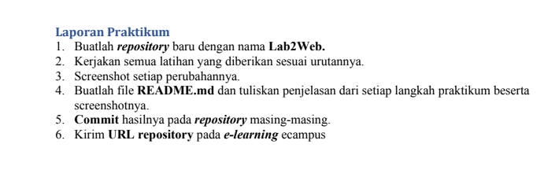
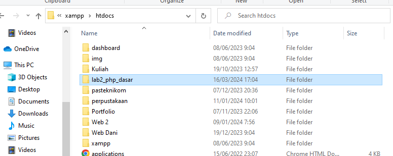
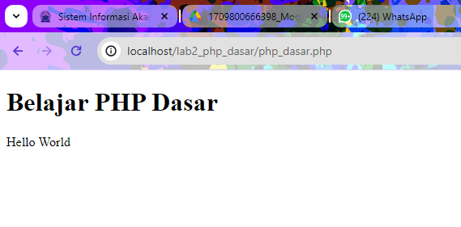
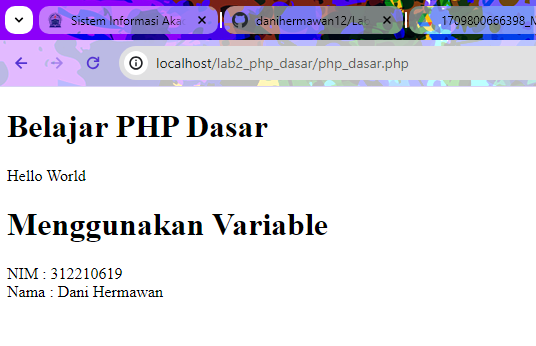
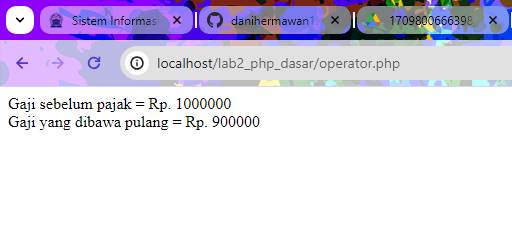
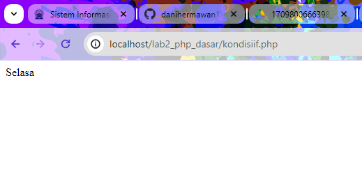
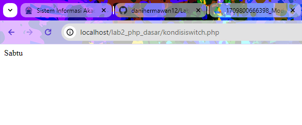
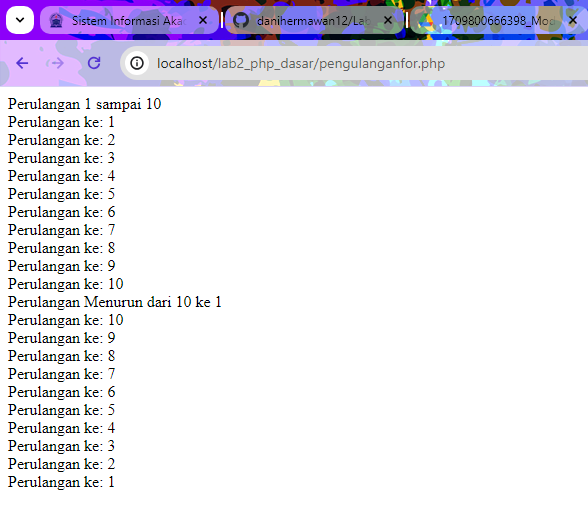
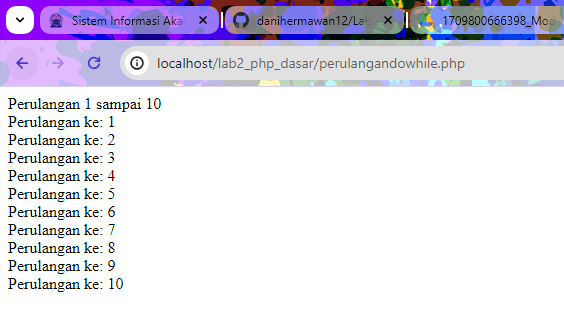

# Lab2Web

# Belajar PHP Dasar

Nama : Dani Hermawan

NIM : 312210619

Kelas : TI.22.B.2

TUGAS



MEMULAI PHP

Buat folder lab2_php_dasar pada root directory web server (d:\xampp\htdocs)



PHP Dasar

```py
<!DOCTYPE html>
<html lang="en">
<head>
<meta charset="UTF-8">
<title>PHP Dasar</title>
</head>
<body>
<h1>Belajar PHP Dasar</h1>
<?php
echo "Hello World";
?>
</body>
</html>
```

Kemudian untuk mengakses hasilnya melalui URL: http://127.0.0.1/lab2_php_dasar/php_dasar.php

OUTPUT



VARIABLE PHP

Menambahkan variable pada program.

```py
<?php
$nim = "312210619";
$nama = 'Dani Hermawan';
echo "NIM : " . $nim . "<br>";
echo "Nama : $nama";
?>
```

OUTPUT



Predefine Variable $_GET

```py
<?php
echo 'Selamat Datang ' . $_GET['nama'];
?>
```

MEMBUAT FORM INPUT

```py
<!DOCTYPE html>
<html lang="en">
<head>
<meta charset="UTF-8">
<title>PHP Dasar</title>
</head>
<body>
<h2>Form Input</h2>
<form method="post">
<label>Nama: </label>
<input type="text" name="nama">
<input type="submit" value="Kirim">
</form>
<?php
echo 'Selamat Datang ' . $_POST['nama'];
?>
</body>
</html>
```

OUTPUT


MODUL PRAKTIKUM PEMOGRAMAN WEB 2

OPERATOR

```py
<?php
$gaji = 1000000;
$pajak = 0.1;
$thp = $gaji - ($gaji*$pajak);
echo "Gaji sebelum pajak = Rp. $gaji <br>";
echo "Gaji yang dibawa pulang = Rp. $thp";
?>
```

OUTPUT



KONDISI IF

```py
<?php
$nama_hari = date("l");
if ($nama_hari == "Sunday") {
echo "Minggu";
} elseif ($nama_hari == "Monday") {
echo "Senin";
} else {
echo "Selasa";
}
?>
```

OUTPUT



KONDISI SWITCH

```py
<?php
$nama_hari = date("l");
switch ($nama_hari) {
case "Sunday":
echo "Minggu";
break;
case "Monday":
echo "Senin";
break;
case "Tuesday":
echo "Selasa";
break;
default:
echo "Sabtu";
}
?>
```
OUTPUT



PERULANGAN FOR

```py
<?php
echo "Perulangan 1 sampai 10 <br />";
for ($i=1; $i<=10; $i++) {
echo "Perulangan ke: " . $i . '<br />';
}
echo "Perulangan Menurun dari 10 ke 1 <br />";
for ($i=10; $i>=1; $i--) {
echo "Perulangan ke: " . $i . '<br />';
}
?>
```

OUTPUT



PERULANGAN WHILE 

```py
<?php
echo "Perulangan 1 sampai 10 <br />";
$i=1;
while ($i<=10) {
echo "Perulangan ke: " . $i . '<br />';
$i++;
}
?>
```

OUTPUT 


PERULANGAN DOWHILE

```py
<?php
echo "Perulangan 1 sampai 10 <br />";
$i=1;
do {
echo "Perulangan ke: " . $i . '<br />';
$i++;
} while ($i<=10);
?>
```

OUTPUT




MEMBUAT PERTANYAAN & TUGAS 

Buatlah program PHP sederhana dengan menggunakan form input yang menampilkan nama, tanggal lahir dan pekerjaan. Kemudian tampilkan outputnya dengan menghitung umur berdasarkan inputan tanggal lahir. Dan pilihan pekerjaan dengan gaji yang berbeda-beda sesuai pilihan pekerjaan.

Coba input sourcode berikut:

```py
<!DOCTYPE html>
<html lang="en">
<head>
<meta charset="UTF-8">
<meta name="viewport" content="width=device-width, initial-scale=1.0">
<title>Hitung Umur dan Gaji</title>
</head>
<body>

<?php
// Fungsi untuk menghitung umur berdasarkan tanggal lahir
function hitungUmur($tanggal_lahir) {
    $tgl_lahir = new DateTime($tanggal_lahir);
    $today = new DateTime('today');
    $umur = $today->diff($tgl_lahir)->y;
    return $umur;
}

// Fungsi untuk menampilkan gaji berdasarkan pekerjaan
function hitungGaji($pekerjaan) {
    switch ($pekerjaan) {
        case 'Pegawai':
            return 5000000;
            break;
        case 'Manager':
            return 15000000;
            break;
        case 'Direktur':
            return 20000000;
            break;
        default:
            return 0;
            break;
    }
}

// Memproses form jika telah disubmit
if ($_SERVER["REQUEST_METHOD"] == "POST") {
    $nama = $_POST["nama"];
    $tanggal_lahir = $_POST["tanggal_lahir"];
    $pekerjaan = $_POST["pekerjaan"];

    // Hitung umur berdasarkan tanggal lahir
    $umur = hitungUmur($tanggal_lahir);

    // Hitung gaji berdasarkan pekerjaan
    $gaji = hitungGaji($pekerjaan);

    // Tampilkan output
    echo "<h2>Output:</h2>";
    echo "<p>Nama: $nama</p>";
    echo "<p>Umur: $umur tahun</p>";
    echo "<p>Pekerjaan: $pekerjaan</p>";
    echo "<p>Gaji: Rp " . number_format($gaji, 0, ',', '.') . "</p>";
}
?>

<h2>Form Input</h2>
<form method="post" action="<?php echo htmlspecialchars($_SERVER["PHP_SELF"]);?>">
    <label for="nama">Nama:</label><br>
    <input type="text" id="nama" name="nama" required><br><br>
    <label for="tanggal_lahir">Tanggal Lahir:</label><br>
    <input type="date" id="tanggal_lahir" name="tanggal_lahir" required><br><br>
    <label for="pekerjaan">Pekerjaan:</label><br>
    <select id="pekerjaan" name="pekerjaan" required>
        <option value="Pegawai">Pegawai</option>
        <option value="Manager">Manager</option>
        <option value="Direktur">Direktur</option>
    </select><br><br>
    <input type="submit" value="Submit">
</form>

</body>
</html>
```

FORM INPUT


OUTPUT


=== SEKIAN & TERIMA KASIH ===

=== Dani Hermawan   ===